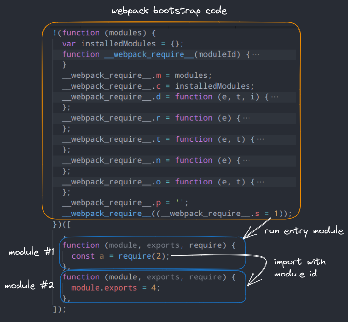

# Bundle Unpacking

This feature can unpack [webpack](https://webpack.js.org/) and [browserify](https://browserify.org/) bundles into separate files.

## Webpack

- `__webpack_require(id)__` gets rewritten to `require('./relative/path.js')`.

- Modules may get converted to ESM.

- multiple chunks are not supported _yet_.



<!-- ::: details  -->

<!-- ### `__webpack_require__` properties and functions -->

### `__webpack_require__`

```ts
/**
 * Most of the time this is an object for multiple exports,
 * but a module can export anything
 */
type Exports = unknown;

/**
 * Each module is wrapped in a factory function to give it access to these arguments like they were global variables
 */
type FactoryFunction = (
  module: Module,
  exports: Exports,
  __webpack_require__: WebpackRequire,
) => void;

interface Module {
  exports: Exports; // module exports
  i: number; // module id
  l: boolean; // loaded
}
```

`__webpack_require__` is a function with some additional properties:

```ts
interface WebpackRequire {
  // Call to load a module
  (moduleId: number): Exports;
  // Define getter functions for esm exports
  d(exports: Exports, name: string, getter: () => Exports): void;
  // Load a chunk
  e(chunkId: number): Promise<Exports>;
  // Returns globalThis or window
  g(): typeof globalThis;
  // loadScript function to load a script via script tag
  l(
    url: string,
    done: (event: Event) => void,
    key: string | undefined,
    chunkId: number,
  ): void;
  // Get the default export of a module, for compatibility with non-esm
  n(exports: Exports): { (): Exports; get a(): Exports };
  // Object.prototype.hasOwnProperty.call
  o(object: unknown, property: string): boolean;
  // On error function for async loading
  oe(err: Error): never;
  // Set __esModule to true
  r(exports: Exports): void;
  // Create a fake namespace object
  t(value: number | Record<string, unknown>, mode: number): unknown;
  // Get javascript chunk filename. Example: u(0) -> 'chunks/0.138aa346.js'
  u(chunkId: number): string;

  // Contains all installed modules. The keys are module ids
  c: Record<number, Module>;
  f: {
    // JSONP chunk loading for javascript
    j(chunkId: number, promises: Promise<unknown>[]): void;
  };
  // Contains all module functions. The keys are module ids
  m: Record<number, FactoryFunction>;
  // Public base path for chunks. Example: '/_next/'
  p: string;
  // Entry module id
  s: number;
  // All WebAssembly.instance exports. The keys are wasm module ids
  w: Record<number, Exports>;
}
```

<!-- ::: -->

## Browserify

Each module has a numerical id and contains a list of dependencies: `{ './foo': 1, './bar': 3 }`.
These paths are relative to the current module and are used like `require('./foo')`.

The absolute path a module is not stored anywhere, so webcrack builds a dependency tree
and resolves the paths to preserve the original file structure as much as possible.

::: details Example

Module id -> dependencies:

```js
{
  0: { 1: './a.js', 4: 'lib' }, // entry
  1: { 2: '../bar/b.js' },
  2: { 3: '../../c.js' },
  3: {},
  4: {},
}
```

Resulting file structure:

```txt
├── tmp0
│   ├── tmp1
│   │   ├── index.js
│   │   └── a.js
│   └── bar
│       └── b.js
├── c.js
```

:::

Sometimes the entry module was deeply nested (e.g. `src/app/index.js`), but `"src"` or `"app"` is not included in the bundle.
In this case, directory names like `tmp0/tmp1`, etc. are used instead.
